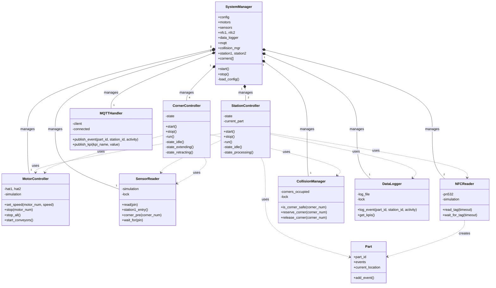

## CircularManuSystem
The repository of a lab-scale 2-station closed-loop manufacturing system. 

*developed by Nikolaos, Bohan*

## Project Overview

This project implements a lab-scale manufacturing system with two processing stations connected in a closed loop using Fischertechnik components and Raspberry Pi control. The system is designed to demonstrate key concepts in automated manufacturing including:

- Part tracking through RFID/NFC technology
- Queue management and buffer behavior
- Real-time process monitoring
- Key performance indicator (KPI) calculation
- Data collection and visualization

## System Architecture

## Production Concept

The system simulates a small manufacturing cell that could represent various real-world processes:

### Manufacturing Scenario 1: Electronics Assembly

- **Station 1**: Component Placement
  Parts are positioned precisely and components are placed onto a circuit board.
  
- **Station 2**: Quality Inspection
  Completed assemblies are inspected for defects using vision systems.

### Manufacturing Scenario 2: Machining Operations

- **Station 1**: Milling Operation
  Raw parts are milled to create specific features or shapes.
  
- **Station 2**: Finishing and Deburring
  Machined parts have sharp edges removed and surfaces smoothed.

### Manufacturing Scenario 3: Packaging Line

- **Station 1**: Product Filling
  Containers are filled with a specified amount of product.
  
- **Station 2**: Labeling and Sealing
  Filled containers are labeled and sealed for shipment.

## System Features

- **Closed-Loop Material Flow**: Parts continuously circulate through the system
- **Software Queuing**: Parts wait at station entrance if the processing position is occupied
- **NFC Tag Identification**: Each part is uniquely